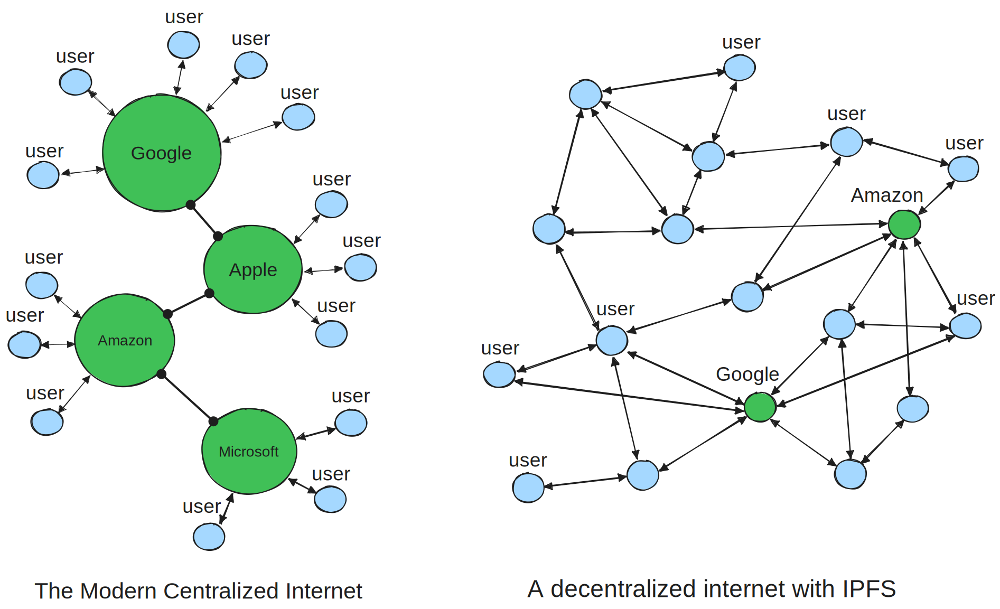
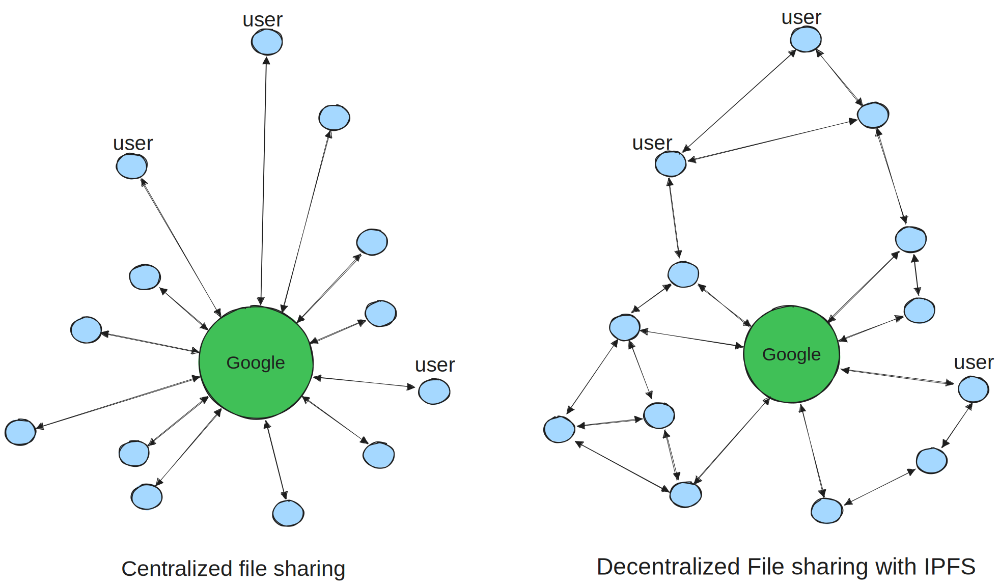

---                               
slug: "IPFS: Revolutionizing the Digital Landscape"
title: "IPFS: Revolutionizing the Digital Landscape"
authors: [jl]
tags: [ipfs, web3, tech]
---

# IPFS: Revolutionizing the Digital Landscape

## Introduction

In a world where digital content is king, a revolutionary technology called IPFS (InterPlanetary File System) is orchestrating a subtle but profound shift in how we exchange and safeguard information. This peer-to-peer protocol has the potential to be a game changer, offering benefits that challenge the traditional methods of data distribution and storage.

## The Essence of IPFS

At its core, IPFS has two factors which makes it way more than just another file storage system; Firstly it's a new way of thinking about the internet. Today, the internet mostly depends on a few prominent companies with robust computers that serve as the foundation or core. This model puts control of the internet into the hands of a small amount of people. IPFS works to change this by using a network of peers to store and find files. In simpler terms all computers interact with each other instead of only interacting the large servers. The second factor which makes IPFS so revolutionary is that it stores the files using content-addressable approach which ensures that files are uniquely identified by their content, This is like giving each file its own special code. So, if a file changes, its code changes too. This mechanism ensures that an unalterable copy remains preserved and accessable.

## Benefits Beyond Measure

IPFS brings a host of benefits to the table, revolutionizing how we interact with data:

- **Decentralization**: By using a network of peers IPFS is eliminating single points of failure, IPFS ensures content remains available even in the face of server outages but also ensuring that no single entity holds the power to control or restrict information flow.
- **Bandwidth Efficiency**: IPFS uses Content addressing which streamlines the process of downloading files you've already accessed. Instead of downloading the same file repeatedly, your computer remembers it, reducing the load on networks. This translates into faster load times for websites hosted on IPFS and more efficient data retrieval for users worldwide.
- **Censorship Resistance**: Censorship can stifle the free flow of knowledge. IPFS flips the script by making censorship difficult. Files on IPFS aren't tied to specific places or controlled by central authorities as anyone from anywhere in the world can run a IPFS node and add files to it. This makes it challenging for anyone to block access, ensuring that information remains free and accessible to all.
- **Data Integrity**:  IPFS leverages cryptographic hashes, which are like digital signatures to ensure data integrity. These hashes get produced using the content of the file and serve as unbreakable seals, guaranteeing that your data remains tamper-proof. 

## Real-World Applications

The versatility of IPFS opens doors to numerous applications:

- **File Sharing**: IPFS streamlines the process of sharing files directly between peers, eliminating the reliance on central servers. But it doesn't stop there. Imagine downloading a file from not just one source, but multiple sources simultaneously, enhancing efficiency and speed. IPFS achieves this by fetching content from nearby nodes and, when possible, engaging in parallel content fetching from numerous nodes at once. This innovation has the potential to revolutionize large-scale file sharing, making it not only faster but also more resilient. examples include [arbose](https://arbo.re/) and [FileNation](https://github.com/FileNation/FileNation)

- **Website Hosting**: Traditional web hosting faces limitations. IPFS works to fix those limilstions by distributing the files for the website across the globe webmasters can exponentially reduce the risk of downtimes due to server failures. This distributed website hosting model paves the way for a more reliable and responsive online presence. Additionally Developers can implement [Fleek](https://fleek.co/) which works similar to using Netlify or vercel by tracking a git repo to automatically build and deploy the website to IPFS using upon changes

- **Content Distribution**: IPFS can optimize global content delivery for Content delivery networks (CDNs). This integration ensures efficient content distribution among various nodes, minimizing delays and enriching user experiences irrespective of their geographic location. Imagine seamlessly streaming videos or accessing large datasets with minimal latency, all thanks to IPFS's distributed content delivery mechanism.

- **Blockchain Integration**: IPFS finds a natural synergy with blockchain technology. Its robustness and cryptographic integrity make it an ideal companion for storing files within blockchain networks. This integration enhances the immutability of blockchain data, safeguarding its integrity while providing a distributed method of data storage that aligns seamlessly with blockchain's decentralized ethos.

- **Software Development**: In the realm of software development, IPFS provides an avenue to store artifacts like binaries or WebAssembly (Wasm) files. By hosting these files on IPFS, developers can ensure stable and reliable distribution, making it easier for users to access and utilize the software's latest versions.

- **Businesses public relations**: Businesses can leverage IPFS to upload official documents and public statements as tamper-resistant text files. This not only provides a decentralized storage solution but also grants the public direct access to information from the source, fostering transparency and trust between businesses and their stakeholders.

As we explore these practical applications, it's evident that IPFS isn't confined to the realm of technology alone. It extends its reach to reshape industries, empower users, and redefine the very foundations of information sharing and storage.

## Community Strength and Vibrancy

The IPFS ecosystem isn't just a technology; it's a thriving community. At the heart of this digital revolution, you'll find a diverse and passionate group of individuals coming together to shape the future of the internet. With over 50 community-built tools and hundreds of other resources showcased at [Awesome IPFS](https://awesome.ipfs.tech), the collective effort is nothing short of remarkable. Regular community meetings, including monthly video calls, provide an open forum for discussions, ideas, and collaborations. The IPFS YouTube channel, boasting over 12,000 followers has more than 1400 videos about the protocol, which serves as a valuable resource hub, making it easier for enthusiasts and newcomers alike to explore and understand this groundbreaking protocol.

Moreover, the community extends its reach beyond the realm of technology. IPFS hosts multiple scientific datasets, effectively distributing costs and ensuring broader access to valuable information. Academic papers dedicated to the protocol and its implementations underline the depth of its impact. With over 350 collaborators actively participating on GitHub, it's clear that the IPFS community isn't just a bystander; it's a driving force behind the evolution of this transformative technology. The sense of camaraderie and shared purpose within the IPFS community is nothing short of inspiring, emphasizing that IPFS isn't just a solitary innovation but a collective journey into the future of the internet.

## Challenges and the Road Ahead 

While IPFS holds immense promise, there are challenges that must be tackled to pave the way for its full potential. Let's delve into these challenges and glimpse the path ahead:

- **Initial Latency Unveiled**: As with any innovative technology, IPFS grapples with the challenge of initial latency. When a user requests a less frequently accessed file for the first time, it might take a little longer to retrieve it compared to traditional centralized systems. This initial delay is due to the distributed nature of IPFS, where content might be stored on one node in a different continent. The community and developers are actively working on reducing this latency to ensure a smoother user experience.

- **Adoption Hurdles and Usability**: The transition to new paradigms always comes with its own set of hurdles. IPFS's decentralized approach requires a shift in mindset and practices, which can slow down its adoption. Additionally, ensuring user-friendly interfaces and seamless integration within existing applications is a task that demands attention. Overcoming these hurdles will be crucial in making IPFS accessible to a wider audience.

- **Content Discovery**: With traditional systems, content discovery is often simplified by centralized servers. In the decentralized realm of IPFS, finding the right content can sometimes be a challenge. Efforts are being directed towards enhancing content discovery mechanisms, making it easier for users to locate and access the information they need without unnecessary complexities.

While these challenges stand as significant roadblocks, the increasing interest and ongoing development within the IPFS community indicate a bright (and decentralised) future. As the technology evolves and matures, we can anticipate enhanced integration, smoother user experiences, and innovative solutions to these obstacles. By addressing these challenges head-on, IPFS inches closer to its vision of a decentralized, efficient, and user-centric digital landscape.

## Conclusion

IPFS is reshaping the digital landscape significantly by disrupting establised norms. Its principles of peer-to-peer collaboration and content-addressable mechanisms signal a fundamental shift beyond technology, while it enhances resilience and efficiency. This transition points toward fair access, improved data control, and enhanced user experiences.

Importantly, IPFS doesn't just encounter challenges; it leverages them for innovation. Initial latency, adoption hurdles, and content discovery intricacies serve as catalysts for progress. Coordinated efforts within the IPFS community to overcome these problems underline its strong commitment to unlocking the technology's potential. This dynamic interaction between challenges and solutions underscores IPFS's evolution.

As IPFS's story unfolds, it encourages collaboration, exploration, and meaningful transformation. Through ups and downs, it envisions a digital world marked by empowerment, accessibility, and heightened security. The assurance of a decentralized, equitable, and censorship-resistant digital domain takes shape through the inventive prowess of this groundbreaking technology.

In summary, IPFS isn't merely changing the rules of the game; it's redefining the basis for a profoundly altered digital future.

**Are you ready to explore the future of the internet? Dive into IPFS and witness the transformation firsthand.**

---

*Explore more about IPFS: [Official IPFS Website](https://ipfs.io/)*

*Have questions or thoughts about IPFS? Share in the comments below!*
